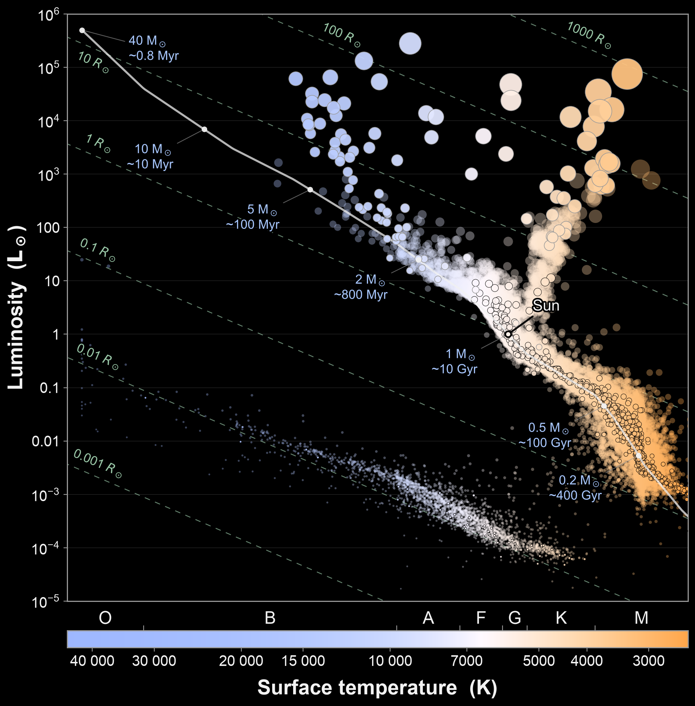
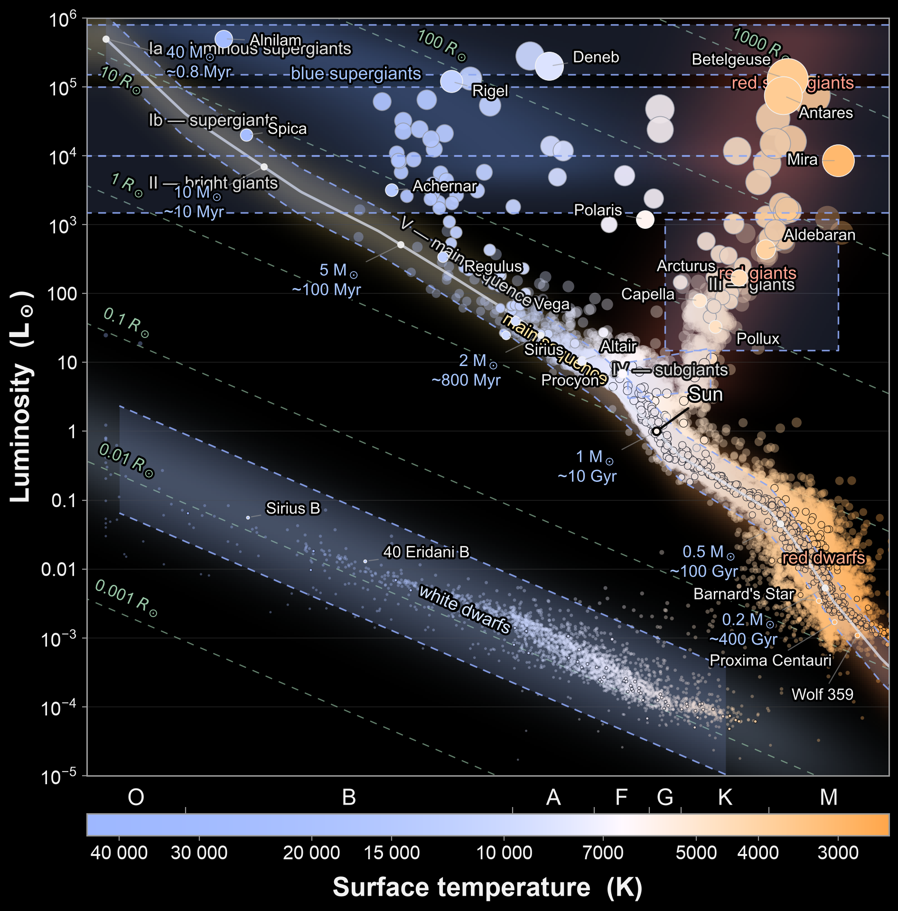

# pretty-hr-diagram

Teaching-oriented Hertzsprung–Russell diagram generator. Main features:

* Many graphical elements that can be toggled (main sequence, stellar 
lifetime labels, luminosity classes, etc.)
* Star colours are approximately reflective of true star colors
rather than the oversaturated ones found in most textbooks.
* Can show populations of stars from Gaia DR3 and Hipparcos data.
* Dark and light background options.
* Option to label arbitrary dots so you can highlight particular features
or produce test questions.


Written with extensive help from Claude (mainly Fable 5). For teaching purposes
only--I don't recommend using this for research purposes.


*An intentionally overcomplicated diagram, showing all features of the program (except the ability to add custom dots). Just about every feature you can see in this image can be toggled on or off.*

## Install

Requires Python 3.11 or newer.

```bash
pip install git+https://github.com/reidma/pretty-hr-diagram
```

or, in a uv-managed project:

```bash
uv add git+https://github.com/reidma/pretty-hr-diagram
```

To work on the code itself, clone the repository and make an editable
install:

```bash
git clone https://github.com/reidma/pretty-hr-diagram
cd pretty-hr-diagram
uv sync          # or: pip install -e .
```

## Use

```python
from hr_diagram import plot_hr_diagram, save_hr_diagram_suite

plot_hr_diagram()                            # the full diagram
plot_hr_diagram(show_famous_stars=True)      # ... with labelled famous stars
plot_hr_diagram(show_star_groups=True)       # ... with soft region clouds
plot_hr_diagram(dark=False)                  # black-on-white version
save_hr_diagram_suite("hr_diagram_figures")  # one PNG per feature group
```

Every layer is a keyword toggle (`show_main_sequence`, `show_radius_lines`,
`show_gaia_sample`, `show_luminosity_classes`, ...); see
`help(plot_hr_diagram)` for the full list.

Star catalogues (~1000 nearest stars and an ~84 000-star sample within
200 pc from Gaia DR3; the ~100 brightest stars from Hipparcos) are
downloaded on first use and cached in `hr_diagram_data/` under the current
working directory.

## Data and calibrations

- Gaia DR3: Gaia Collaboration, Vallenari et al. 2023, A&A 674, A1
- Hipparcos: Perryman et al. 1997, A&A 323, L49
- Spectral types, masses, main-sequence luminosities: Pecaut & Mamajek 2013,
  ApJS 208, 9
- Star colours: Planck spectrum through the CIE 1931 colour-matching
  functions (Wyman, Sloan & Shirley 2013, JCGT 2(2))
- B−V → temperature: Ballesteros 2012, EPL 97, 34008

All quantities are approximate and chosen for clarity of visualisation, not
for quantitative analysis.
